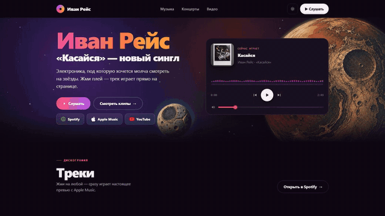

🇬🇧 English · [🇷🇺 Русский](README.ru.md)

# ivanreys-landing

Landing page for electronic artist Ivan Reys ("Cold Space" / «Холодный космос»): a working player with real track previews (Apple Music), YouTube clips, and links to all streaming platforms.

**Live:** https://ivanreys.vercel.app



## Stack

A single self-contained `index.html` — no build step, no dependencies. HTML + CSS + vanilla JavaScript (one inline `<script>`, no external scripts or stylesheets).

## Features

- WebAudio player: plays real 30-second previews, the waveform reacts to the track's frequency spectrum (`AudioContext` + `createAnalyser`), click-to-seek, volume and mute; the album cover changes with the track
- Canvas "cosmos" hero: nebula and stars are pre-rendered into layers, 4 blits per frame; the animation loop stops completely when the hero is out of the viewport (`IntersectionObserver`) or the tab is hidden (`visibilitychange`)
- Assets: planet/moon images re-encoded to WebP (2.9 MB → 0.2 MB), `preload` of the LCP image
- `content-visibility: auto` on below-the-fold sections, YouTube facades (the iframe is created only on click)
- Light/dark theme, `prefers-reduced-motion` support, real artist data only

## Architecture

```
index.html        the whole site: markup, styles and script in one file
artist.jpg        artist photo
cover.jpg         album cover
planet.webp       hero assets (PNG originals kept alongside)
moon.webp
media/            promo-video tooling (not part of the site):
  preview.html    1:1 preview page used for recording
  record.mjs      records the preview with puppeteer-core + ffmpeg-static
  verify.mjs      screenshots the preview at fixed timestamps
  genclick.mjs    generates a click sound (WAV)
```

## Run locally

Open `index.html` directly in a browser, or serve the folder with any static file server, e.g.:

```sh
npx serve .
```

Deploy: `vercel deploy --prod --yes`.

## License

The code is licensed under the [MIT License](LICENSE).

Music, videos and images of the artist (including `artist.jpg`, `cover.jpg` and all media referenced by the page) are © Ivan Reys, all rights reserved, and are not covered by the MIT license.
